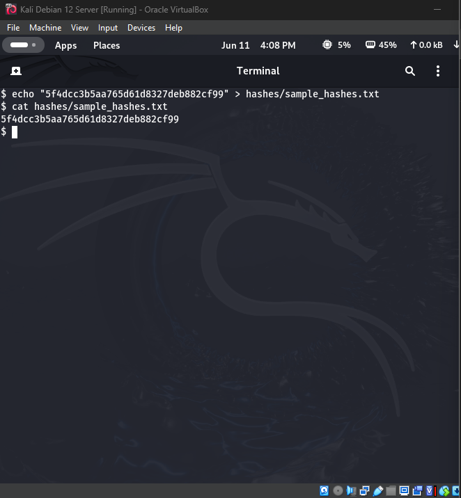
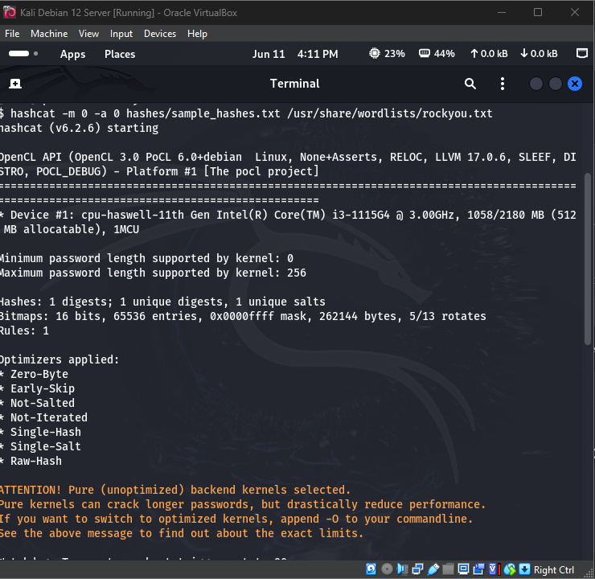
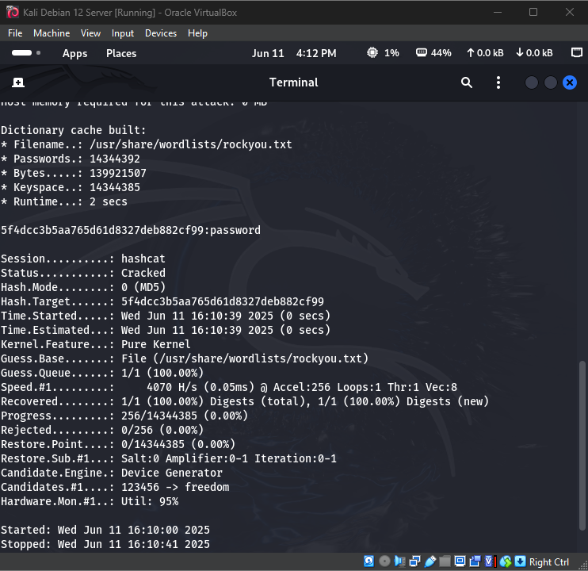
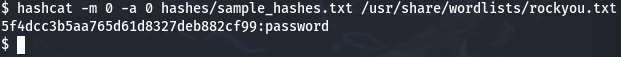

### ✅ `README.md` for `Hashcat-BruteForce-Lab`

```markdown
# Hashcat Password Cracking Lab

## 🔐 Overview

This lab demonstrates how password hashes can be cracked using brute-force dictionary attacks with Hashcat. All work was performed inside a Kali Linux virtual machine in a controlled, ethical cybersecurity lab environment.

## 🛠️ Tools Used

- Kali Linux VM
- Hashcat v6.2.6
- rockyou.txt wordlist
- MD5 sample hash file

---

## 🧪 Lab Setup

### 📁 Hash File

Path: `hashes/sample_hashes.txt`  
Contents:
```

5f4dcc3b5aa765d61d8327deb882cf99

````
This is the MD5 hash of the common password: `password`.

---

### 📁 Wordlist Used

```bash
/usr/share/wordlists/rockyou.txt
````

This wordlist is commonly used in password cracking attacks and contains millions of real-world leaked passwords.

---

## 🔨 Hashcat Command Used

```bash
hashcat -m 0 -a 0 hashes/sample_hashes.txt /usr/share/wordlists/rockyou.txt
```

* `-m 0`: MD5 hash type
* `-a 0`: Dictionary attack
* `--show`: Displays cracked hash + password

---

## 📸 Screenshots

### 🔓 1. Hash File Created



---

### 🚀 2. Hashcat Cracking Process (Successful)





---

### ✅ 3. Final Cracked Output

```bash
hashcat --show ...
```



---

## 🧠 Summary

This lab shows how easily weak passwords can be cracked using public wordlists and free tools. It highlights the importance of:

* Avoiding common passwords
* Using stronger hashing algorithms (with salt)
* Implementing MFA in real-world systems

---

## 👨🏽‍💻 Author

**Kerry “KJ” Jackson II**
🎓 Computer Information Systems Major | Cybersecurity Minor
🔗 [LinkedIn](https://www.linkedin.com/in/kerry-jackson-ii-b6795126b/)
🔗 [GitHub](https://github.com/kjacksonn)
